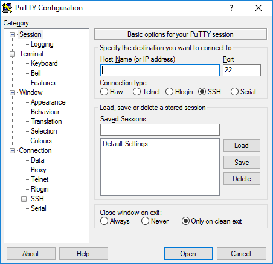
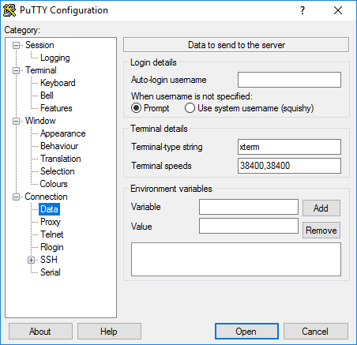

# Setting Up LittleFe
This activity is a way for you to get your account on the LittleFe cluster(s) set up.  During this activity, you will interact with Linux using a shell (in this case, Bash).  By the end of this class, you will have:

 * Changed your password on the Linux boxes to something only you know
 * Used a text editor to set up your environment
 * Written and compiled a very simple program in the C programming language

Please note: there are 44 of you logged on to a rather small machine.  This is many users for one single (admittedly not very powerful) computer; as such, commands you run may be slow.  Throughout the semester, you will be introduced to other systems you can use for assignments (I’m currently working on getting them set up).

This assignment is due at the end of class time.  You will use gitsubmit to upload your assignment.

## Setting Up Atom

If you have not done so yet, follow the instructions on the course website to configure and set up atom.

## Writing the initial C Code

Create a new file in the project directory named main.c that contains the following:

```
#include<stdio.h>
int main(int argc, char* argv[])
{
  if (argc > 1)
    printf(“Hello world, my name is %s\n”, argv[1]);
  else
    printf("Hello world!\n")
  return 0;
}
```
Compile and run the code as per the instructions found in the document detailing setting up atom.

Submit your code using gitsubmit
## PuTTY
Download PuTTY from http://www.chiark.greenend.org.uk/~sgtatham/putty/download.html

Install it (or open it, depending on whether you grabbed the installer or the standalone version).  You should see a window that looks similar to


Click on the "Data" Category (under Connection), and you should see:


 In the "Auto-login username" field, put your S number (with a capital S).

 Select the Session Category (you should see the first image above).

 In the Host Name field, type ```littlefe1``` .  In the Saved Sessions field, give this session a name you will remember.  I named it LIttleFe1 because, well, I’m connecting to a LittleFe1 box.  Hit the save button, and thenthe Open button at the bottom of the window.

A black window will appear asking you for your password.  Your password is the same as your username (with the capital S). This is the case EVEN IF YOU HAD A PREVIOUS ACCOUNT ON LITTLEFE. After supplying your password you will be greeted with a prompt that looks something like this:


We will talk more in depth about what exactly is going on here (or maybe we already have!), but for now, know that you are logged into a Linux computer that is in a different room, but for all we know, the box could be in a different state, or country.  Anecdote alert: I’ve logged into a linux computer sitting in Missouri while I was attending a conference in Brighton, UK.  There’s a lot of power here.

The very first thing we will do is change your password.  To do this, type in the following command:
```
passwd
```
and hit enter.  Note that this is case sensitive. In the future in this document, if you see text in the above font (Courier New), it will be things you type into your session in PuTTY.  The passwd program will run, and ask for your current password.  Type your password, then hit enter.  It will ask you to type your new password, hit enter, then type your new password again (and hit enter).  Do so.

We are going to add some colors to the screen.  Run the command
```
nano .bash_profile
```
and scroll to the bottom (nano is a text editor).  At the very bottom of this file, add the following line:

```
export PS1=’\[\033[01;32m\]\u@\h\[\033[00m\]:\[\033[01;34m\]\w\[\033[00m\]\$’
```

You may just copy and paste the above.  It *should* work, but no promises on the encoding.  Once your window contains the above text, save and exit by hitting ctrl+X and Y <enter> to the question about saving.  Finally run the command:
```
source .bash_profile
```
Go to http://gitlab.nwmissouri.edu, and find the project that corresponds to this assignment (which is probably called lastname+firstinitial_lab00).  Go to that project page.  At the top of the window, you should see a little drop down menu that has the word SSH in that.  Choose that drop down menu, and select HTTP.  Copy the text in the window next to it to your clipboard.  Go back to your putty window, and run the following command:
```
git clone url_you_just_copied
```
It should ask for your gitlab password.

There should now be a directory for the project.  For me, it would be named
```
eloen_lab00
```

I want to enter that directory, so I would type
```
cd eloen_lab00
```
and hit enter.

If you run the
```
ls
```
command, you should see the c file you submitted earlier.  Run the following command:
```
gcc main.c
```

It should compile without errors.
Run the following command:
```
./a.out bob
```

Run the following commands:

```
./a.out me >> output.txt
./a.out >> output.txt
./a.out $USER$ >> output.txt
```

You can check out the content of output.txt by running
```
cat output.txt
```

### Submitting your new/changed files
Run the following commands:
```
git add output.txt
git commit -m 'Added project output'
git push
```

It should ask for your gitlab username and password again.  Provide it.  Once it says you have finished uploading it, you should see the new file in gitlab!

Leave the SSH session by running
```
exit
```
